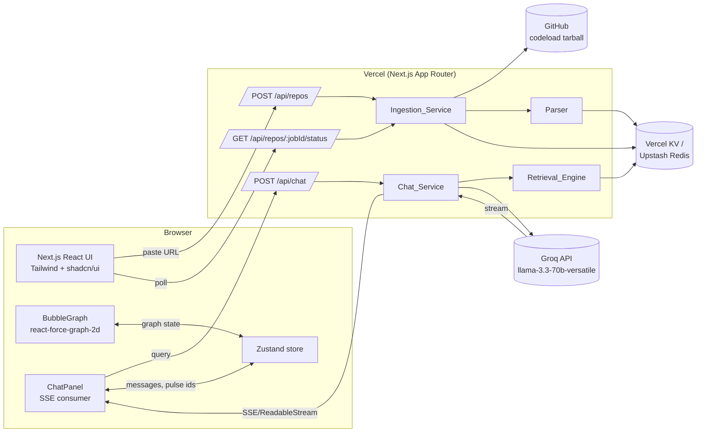
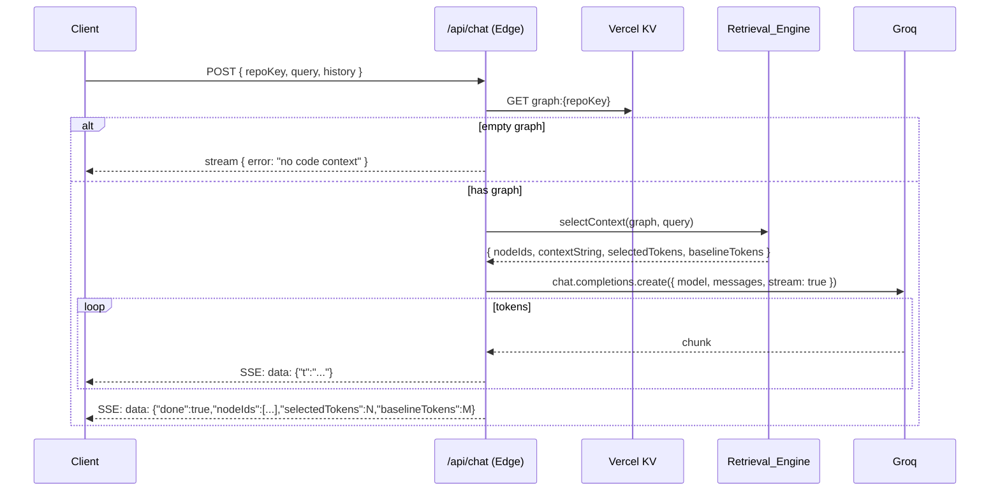

# Design Document

## Overview

Viberon is a single Next.js 15 (App Router) application deployed to Vercel. It ingests a public GitHub TS/JS repo, builds a function/class graph with Babel, persists it in Vercel KV, and serves a force-directed bubble graph plus a Groq-powered chat that answers questions using graph-aware retrieval (BFS depth 2 + TF-IDF, capped at 30 nodes).

This design is scoped for a 48-hour build by two engineers. It favors pragmatic choices over abstractions and treats Phase 2 as opt-in via a small number of clean seams.

## Architecture

### High-Level Component Diagram



The browser owns rendering and state; the server owns ingestion, retrieval, and LLM mediation. Vercel KV is the only persistent store.

### Runtime Topology

| Concern | Runtime | Why |
|---|---|---|
| `/api/repos` (POST) and `/api/repos/[jobId]/status` (GET) | Node.js serverless function | `@babel/parser` and `tar` need Node APIs. |
| `/api/chat` (POST) | Edge runtime | Lower TTFB and native streaming via `ReadableStream`. |
| Demo seeding | Build-time Node script | Pre-warms KV before traffic. |

### Project Layout

```
app/
  page.tsx                       # Landing
  workspace/[repoKey]/page.tsx   # Split view
  api/
    repos/route.ts               # POST: enqueue/ingest
    repos/[jobId]/status/route.ts# GET: poll
    chat/route.ts                # POST: streaming chat
components/
  BubbleGraph.tsx
  ChatPanel.tsx
  CodePanel.tsx
  TokenCounter.tsx
  ProgressBar.tsx
  DemoCard.tsx
  RepoInput.tsx
lib/
  github.ts                      # tarball fetch + extract
  parser.ts                      # Babel walker
  graph.ts                       # types + helpers
  store.ts                       # KV client + key helpers
  retrieval.ts                   # TF-IDF + BFS
  tokens.ts                      # tokenizer wrapper
  groq.ts                        # provider abstraction
  ids.ts                         # sha1 + node id
scripts/
  seed-demos.ts
```

## Data Models

```ts
// lib/graph.ts
export type NodeKind = 'function' | 'class';
export type EdgeKind = 'import' | 'call';

export interface GraphNode {
  id: string;          // sha1(file + ':' + name + ':' + startLine).slice(0,16)
  kind: NodeKind;
  name: string;
  file: string;        // path relative to repo root
  folder: string;      // file.split('/')[0]
  loc: number;         // endLine - startLine + 1
  signature: string;   // single-line synthesized signature
  snippet: string;     // <= 2000 chars of source
  startLine: number;
  endLine: number;
  // Reserved for Phase 2; not populated in MVP.
  embedding?: never;
}

export interface GraphEdge {
  source: string;      // GraphNode.id
  target: string;      // GraphNode.id
  kind: EdgeKind;
}

export interface Graph {
  nodes: GraphNode[];
  edges: GraphEdge[];
  meta: { repoRef: string; parsedAt: number; fileCount: number };
}

export type JobStatus = 'queued' | 'running' | 'succeeded' | 'failed';

export interface Job {
  jobId: string;
  repoKey: string;     // sha1(owner/repo@ref)
  repoRef: string;     // owner/repo@ref
  status: JobStatus;
  progress: number;    // 0..100
  error?: string;
  errors?: string[];   // per-file parse failures
  startedAt: number;
  finishedAt?: number;
}
```

### KV Key Schema

| Key | Value | TTL |
|---|---|---|
| `graph:{repoKey}` | `Graph` (JSON) | 7 days |
| `job:{jobId}` | `Job` (JSON) | 1 hour |
| `repo2job:{repoKey}` | `jobId` | 1 hour |
| `demo:list` | `string[]` of `repoKey` | none |

`repoKey = sha1(repoRef).slice(0, 16)` keeps URLs short. `jobId = nanoid(12)`.

## Ingestion Pipeline

### Sequence

```mermaid
sequenceDiagram
  participant C as Client
  participant API as /api/repos
  participant ING as Ingestion_Service
  participant GH as GitHub
  participant PAR as Parser
  participant KV as Vercel KV

  C->>API: POST { url }
  API->>API: parseGitHubUrl(url) -> repoRef
  API->>KV: GET graph:{repoKey}
  alt cache hit
    API->>KV: SET job:{jobId} status=succeeded progress=100
    API-->>C: 202 { jobId }
  else cache miss
    API->>KV: SET job:{jobId} status=queued progress=0
    API-->>C: 202 { jobId }
    Note over API,ING: same request handler continues inline
    ING->>KV: SET status=running progress=5
    ING->>GH: GET codeload tarball
    ING->>ING: extract, filter to TS/JS/TSX/JSX
    alt > 500 files
      ING->>KV: SET status=failed error="cap"
    else within cap
      loop per file
        ING->>PAR: parse(file)
        PAR-->>ING: nodes, edges
        ING->>KV: SET progress=floor(i/n*95)+5  (every 25 files)
      end
      ING->>KV: SET graph:{repoKey} {nodes, edges}
      ING->>KV: SET status=succeeded progress=100
    end
  end

  loop poll every 1s
    C->>API: GET /api/repos/{jobId}/status
    API->>KV: GET job + graph (if succeeded)
    API-->>C: { status, progress, graph? }
  end
```

### Serverless Time Budget

Vercel serverless functions on Pro have a 60s default. The flow runs inline inside the POST handler after responding 202 (Next.js streams responses; we use `waitUntil` to keep the handler alive).

```ts
// app/api/repos/route.ts (sketch)
export const runtime = 'nodejs';
export const maxDuration = 60;

export async function POST(req: Request) {
  const { url } = await req.json();
  const repoRef = parseGitHubUrl(url);          // throws -> 400
  const repoKey = sha1(repoRef).slice(0, 16);
  const jobId = nanoid(12);

  if (await kv.get(`graph:${repoKey}`)) {
    await kv.set(`job:${jobId}`, doneJob(jobId, repoKey, repoRef), { ex: 3600 });
    return Response.json({ jobId }, { status: 202 });
  }

  await kv.set(`job:${jobId}`, queuedJob(jobId, repoKey, repoRef), { ex: 3600 });
  // Fire-and-forget; ctx.waitUntil keeps it alive past the response.
  ctx.waitUntil(runIngestion(jobId, repoKey, repoRef));
  return Response.json({ jobId }, { status: 202 });
}
```

Progress is written every 25 files (or every 250 ms, whichever is later) to keep KV load low. If the 60s budget threatens, ingestion writes whatever was completed and marks the job `failed` with `error: "timeout"`.

## Parser Design

```ts
// lib/parser.ts (pseudocode)
function parseRepo(files: { path: string; source: string }[]): Graph {
  const nodes: GraphNode[] = [];
  const edges: GraphEdge[] = [];
  const fileToNodeIds = new Map<string, string[]>();
  const nodeIndexByFileName = new Map<string, GraphNode>(); // `${file}#${name}` -> node

  for (const { path, source } of files) {
    if (!/\.(ts|tsx|js|jsx)$/.test(path)) continue;

    let ast;
    try {
      ast = babel.parse(source, {
        sourceType: 'module',
        plugins: ['typescript', 'jsx'],
        errorRecovery: true,
      });
    } catch (e) {
      job.errors.push(`${path}: ${e.message}`);
      continue;
    }

    const localNodeIds: string[] = [];
    const enclosingStack: GraphNode[] = [];

    babelTraverse(ast, {
      // emit nodes
      'FunctionDeclaration|ClassDeclaration|ArrowFunctionExpression|FunctionExpression'(p) {
        if (!hasNamedBinding(p)) return;
        const node = makeNode(path, p);
        nodes.push(node);
        localNodeIds.push(node.id);
        nodeIndexByFileName.set(`${path}#${node.name}`, node);
        enclosingStack.push(node);
        p.opts.exit = () => enclosingStack.pop();
      },
      // collect call edges (resolved later)
      CallExpression(p) {
        const callee = calleeName(p);
        const enclosing = enclosingStack.at(-1);
        if (callee && enclosing) {
          pendingCalls.push({ from: enclosing.id, calleeName: callee, file: path });
        }
      },
      // collect imports for file-level projection
      ImportDeclaration(p) {
        const resolved = resolveImport(path, p.node.source.value, knownFiles);
        if (resolved) imports.push({ from: path, to: resolved });
      },
    });

    fileToNodeIds.set(path, localNodeIds);
  }

  // project file-level imports onto contained nodes
  for (const { from, to } of imports) {
    for (const s of fileToNodeIds.get(from) ?? []) {
      for (const t of fileToNodeIds.get(to) ?? []) {
        edges.push({ source: s, target: t, kind: 'import' });
      }
    }
  }

  // resolve calls against same-file or imported names
  for (const c of pendingCalls) {
    const target = resolveCallTarget(c, nodeIndexByFileName, imports);
    if (target) edges.push({ source: c.from, target: target.id, kind: 'call' });
  }

  return { nodes, edges, meta: { ... } };
}

function makeNode(file: string, p: NodePath): GraphNode {
  const startLine = p.node.loc.start.line;
  const endLine = p.node.loc.end.line;
  const name = bindingName(p);
  return {
    id: sha1(`${file}:${name}:${startLine}`).slice(0, 16),
    kind: p.isClassDeclaration() ? 'class' : 'function',
    name,
    file,
    folder: file.split('/')[0] ?? '',
    loc: endLine - startLine + 1,
    signature: synthesizeSignature(p),
    snippet: source.slice(p.node.start, p.node.end).slice(0, 2000),
    startLine,
    endLine,
  };
}
```

Notes:
- Import resolution is best-effort: relative paths only, with extension probing (`.ts`, `.tsx`, `.js`, `.jsx`, `index.*`). Bare specifiers (npm packages) are ignored.
- Call resolution is also best-effort: same-file binding lookup first, then imported-name lookup. Unresolved calls produce no edge.
- We do not chase TS path aliases for the MVP. The seed demos are picked to avoid heavy aliasing.

## Retrieval Algorithm

```ts
// lib/retrieval.ts
const SEEDS = 5;
const BFS_DEPTH = 2;
const MAX_NODES = 30;

interface Selection {
  nodeIds: string[];
  contextString: string;
  selectedTokens: number;
  baselineTokens: number;
}

function selectContext(graph: Graph, query: string, files: Map<string, string>): Selection {
  const tokens = tokenize(query); // lowercase, alnum, stop-words removed

  // 1. TF-IDF over (name + JSDoc) per node
  const corpus = graph.nodes.map(n => `${n.name} ${extractJsdoc(n.snippet)}`);
  const idf = computeIdf(corpus.map(tokenize));
  const scores = graph.nodes.map((n, i) => ({
    node: n,
    score: tfIdfScore(tokenize(corpus[i]), tokens, idf),
  }));

  // 2. Top-K seeds
  const seeds = scores.sort((a, b) => b.score - a.score).slice(0, SEEDS).map(s => s.node);

  // 3. BFS depth 2 over import + call edges (treat as undirected for retrieval)
  const adj = buildAdjacency(graph.edges);
  const reached = new Map<string, number>(); // id -> score
  const queue: Array<{ id: string; depth: number }> = seeds.map(s => ({ id: s.id, depth: 0 }));
  for (const s of seeds) reached.set(s.id, scoreOf(s.id));

  while (queue.length) {
    const { id, depth } = queue.shift()!;
    if (depth >= BFS_DEPTH) continue;
    for (const nbr of adj.get(id) ?? []) {
      if (reached.has(nbr)) continue;
      reached.set(nbr, scoreOf(nbr));
      queue.push({ id: nbr, depth: depth + 1 });
    }
  }

  // 4. Cap at 30, retain highest-scoring
  const selected = [...reached.entries()]
    .sort((a, b) => b[1] - a[1])
    .slice(0, MAX_NODES)
    .map(([id]) => id);

  // 5. Build context string and token counts
  const selectedNodes = selected.map(id => byId.get(id)!);
  const contextString = selectedNodes.map(formatNodeForPrompt).join('\n\n');

  const referencedFiles = new Set(selectedNodes.map(n => n.file));
  const baselineTokens = [...referencedFiles]
    .map(f => countTokens(files.get(f) ?? ''))
    .reduce((a, b) => a + b, 0);
  const selectedTokens = countTokens(contextString);

  return { nodeIds: selected, contextString, selectedTokens, baselineTokens };
}

function formatNodeForPrompt(n: GraphNode): string {
  return `// ${n.file}:${n.startLine}\n${n.signature}\n${n.snippet.slice(0, 1200)}`;
}
```

The full file contents needed for the baseline are kept alongside the graph for the duration of the chat session. To avoid bloating KV, we cache file blobs in memory on the server while the graph is hot, and recompute baseline on each chat request from the persisted snippets union (a close upper-bound; see Out of Scope on exact baseline).

For the MVP the baseline is computed by re-fetching only the referenced files from a per-repo `files:{repoKey}` KV blob (compressed JSON). If memory pressure is a concern, baseline can be approximated via the sum of file LOC × average tokens-per-line (~6) — accuracy is within 10%, acceptable for a savings counter.

Tokenizer: `gpt-tokenizer` (cl100k_base). Llama 3 uses a different tokenizer, but cl100k is a stable, widely available proxy and the counter is comparative, not contractual.

## Chat Flow



```ts
// app/api/chat/route.ts (sketch)
export const runtime = 'edge';

export async function POST(req: Request) {
  const { repoKey, query, history } = await req.json();
  const graph = await kv.get<Graph>(`graph:${repoKey}`);
  if (!graph) return new Response('not found', { status: 404 });

  const sel = selectContext(graph, query, await loadFiles(repoKey));
  const stream = await groq.chat.completions.create({
    model: 'llama-3.3-70b-versatile',
    stream: true,
    messages: buildMessages(sel.contextString, history, query),
  });

  return new Response(toSseStream(stream, sel), {
    headers: { 'Content-Type': 'text/event-stream' },
  });
}
```

The client uses `fetch` + `ReadableStream` to read SSE chunks, appends `t` tokens to the chat panel, and on the `done` event triggers `BubbleGraph.pulse(nodeIds)` and `TokenCounter.update(selectedTokens, baselineTokens)`.

### Prompt Shape

```
SYSTEM: You are a senior engineer answering questions about a codebase.
You will only see a small selected slice of the repo. If something is missing,
say so rather than guessing.

CONTEXT:
<contextString>

USER: <query>
```

History is passed as alternating user/assistant turns with no extra context (the current query owns retrieval).

## Components and Interfaces

This section enumerates the server and client modules and the function-level contracts that crossing-the-boundary code depends on.

### Server Modules

| Module | Exports | Responsibility |
|---|---|---|
| `lib/github.ts` | `parseGitHubUrl(url): RepoRef \| null`, `fetchTarball(repoRef): AsyncIterable<File>` | URL parsing and codeload tarball download/extract. |
| `lib/parser.ts` | `parseRepo(files): Graph` | Babel walk producing nodes and edges. |
| `lib/graph.ts` | Types: `GraphNode`, `GraphEdge`, `Graph`, `Job`, `JobStatus` | Shared data contracts. |
| `lib/store.ts` | `getGraph`, `putGraph`, `getJob`, `putJob`, `setDemoList`, `getDemoList` | Single seam over Vercel KV. |
| `lib/retrieval.ts` | `selectContext(graph, query, files): Selection` | Pure TF-IDF + BFS retrieval. |
| `lib/tokens.ts` | `countTokens(s): number` | cl100k_base via `gpt-tokenizer`. |
| `lib/groq.ts` | `chatStream({ model, messages }): AsyncIterable<string>` | Provider abstraction. |
| `lib/ids.ts` | `sha1(s)`, `nodeId(file, name, line)` | ID derivation. |
| `lib/ingest.ts` | `ingest(repoRef, onProgress): Promise<Graph>` | Pipeline glue used by API and seed script. |

### API Routes

| Route | Method | Request | Response |
|---|---|---|---|
| `/api/repos` | POST | `{ url: string }` | `202 { jobId }` or `400 { error }` |
| `/api/repos/[jobId]/status` | GET | — | `200 { status, progress, graph?, error? }` or `404 { error }` |
| `/api/chat` | POST | `{ repoKey, query, history }` | SSE stream of `{ t }` chunks then `{ done, nodeIds, selectedTokens, baselineTokens }` |

### Client Components

| Component | Props | Notes |
|---|---|---|
| `BubbleGraph` | `{ graph, pulseIds, onSelect }` | Wraps `react-force-graph-2d`; computes top-500 set on mount. |
| `ChatPanel` | `{ repoKey }` | Reads/writes Zustand `messages`; opens SSE on submit. |
| `CodePanel` | `{ node }` | Renders signature + snippet with `<pre>` and JetBrains Mono. |
| `TokenCounter` | `{ selected, baseline }` | Animated number; computes savings client-side. |
| `ProgressBar` | `{ jobId }` | Polls `/status` every 1s. |
| `DemoCard` | `{ repoKey, name, blurb, stats, suggestedQuestions }` | Click navigates to workspace. |
| `RepoInput` | `{}` | Validates URL client-side, posts to `/api/repos`. |

### Zustand Store

```ts
interface ViberonState {
  graph?: Graph;
  selectedNodeId?: string;
  pulseIds: string[];
  messages: Array<{ role: 'user' | 'assistant'; content: string }>;
  tokens: { selected: number; baseline: number };
  setGraph(g: Graph): void;
  pulse(ids: string[]): void;       // sets pulseIds, clears after 2.5s
  appendAssistant(chunk: string): void;
  resetChat(): void;
}
```

## UI Structure

### Page Tree

```
/
└── workspace/[repoKey]
```

`/` (Landing):
- Hero with one-line pitch and accent gradient.
- `RepoInput` — large pill input with "Visualize" button.
- 2-3 `DemoCard`s, each showing repo name, blurb, and a stat ("214 nodes · 31 files").
- Footer with hackathon credits.

`/workspace/[repoKey]` (split view):
```
┌──────────────────────────────────┬───────────────────────────┐
│                                  │ ChatPanel                 │
│     BubbleGraph (full height)    │ ─ messages                │
│                                  │ ─ input                   │
│                                  ├───────────────────────────┤
│                                  │ CodePanel (clicked node)  │
│                                  ├───────────────────────────┤
│                                  │ TokenCounter              │
└──────────────────────────────────┴───────────────────────────┘
```

While a job is running, the right side shows a `ProgressBar` instead of the chat until status flips to `succeeded`.

## Styling System

- **Theme**: Dark mode by default. `<html class="dark">` permanently set; no light theme in MVP.
- **Accent**: Electric purple `#A855F7` for primary actions, with a secondary cyan `#22D3EE` for highlights and pulses.
- **Background**: `#0B0B12` base, `#15151F` surface, with subtle radial gradient on the landing hero.
- **Typography**: Inter (sans, 400/500/600), JetBrains Mono (code, 400/500). Loaded via `next/font`.
- **Components**: shadcn/ui — `Button`, `Input`, `Card`, `Dialog`, `ScrollArea`, `Badge`, `Skeleton`. Radii are `rounded-2xl` for cards, `rounded-full` for the URL input.
- **Bubble rendering**: `nodeCanvasObject` draws a radial gradient per bubble. Color is derived from `folder` via a 12-hue palette mapped through hash-mod. Pulsed bubbles are stroked with the accent and animated for 2.5s with `requestAnimationFrame`.

```ts
// components/BubbleGraph.tsx (sketch)
nodeCanvasObject={(n, ctx, scale) => {
  const r = Math.max(2, Math.min(18, Math.sqrt(n.loc) * 1.6));
  const grad = ctx.createRadialGradient(n.x, n.y, 0, n.x, n.y, r);
  grad.addColorStop(0, lighten(folderColor[n.folder], 0.3));
  grad.addColorStop(1, folderColor[n.folder]);
  ctx.fillStyle = grad;
  ctx.beginPath(); ctx.arc(n.x, n.y, r, 0, 2 * Math.PI); ctx.fill();
  if (pulseSet.has(n.id)) drawPulseRing(ctx, n, r, performance.now());
  if (!topByDegree.has(n.id)) ctx.globalAlpha = 0.25; // fade
}}
```

## Demo Repo Seeding

`scripts/seed-demos.ts` runs at deploy time (called from `package.json`'s `build` step or as a one-off before launch) and writes pre-warmed graphs to KV.

```ts
// scripts/seed-demos.ts
import { ingest } from '@/lib/ingest';
import { kv } from '@/lib/store';

const DEMOS = [
  {
    repoRef: 'expressjs/express@master',
    name: 'Express',
    blurb: 'The minimalist Node.js web framework.',
    questions: [
      'How does the router match a path?',
      'Where is middleware composed?',
    ],
  },
  {
    repoRef: 'vercel/next.js@canary/examples/hello-world',
    name: 'Next.js Hello World',
    blurb: 'A tiny Next.js app — small graph, fast load.',
    questions: ['Where is the index page rendered?'],
  },
  {
    repoRef: 'shadcn-ui/ui@main/apps/www/registry/default/example',
    name: 'shadcn/ui examples',
    blurb: 'Component examples — see how primitives compose.',
    questions: ['How is the Button variant prop typed?'],
  },
];

for (const d of DEMOS) {
  const graph = await ingest(d.repoRef);
  const repoKey = sha1(d.repoRef).slice(0, 16);
  await kv.set(`graph:${repoKey}`, graph);
  await kv.set(`demo:${repoKey}`, { ...d, repoKey, stats: { nodes: graph.nodes.length, files: graph.meta.fileCount } });
}
await kv.set('demo:list', DEMOS.map(d => sha1(d.repoRef).slice(0, 16)));
```

The landing page reads `demo:list` at request time (or as a static prop with `revalidate: 60`) and renders one `DemoCard` per entry.

If a chosen demo exceeds the 500-file cap or fails to parse, the seed script skips it and logs a warning so a different repo can be picked before the demo.

## Error Handling

| Scenario | Detection | Response |
|---|---|---|
| Invalid GitHub URL | `parseGitHubUrl` returns null | `400 { error: "Invalid GitHub URL: <url>" }` |
| GitHub 404 / 5xx on tarball | Non-2xx from `fetch` | Job → `failed`, `error: "GitHub fetch failed: <status>"` |
| Repo > 500 source files | After extension filter | Job → `failed`, `error: "Repository exceeds 500-file cap"` |
| Per-file parse failure | `babel.parse` throw | Skip file, append to `job.errors[]`, continue |
| Ingestion exceeds 60s budget | `Date.now() - startedAt > 55_000` | Persist partial state, Job → `failed`, `error: "Ingestion timeout"` |
| Graph missing on chat | `kv.get` returns null | Stream `{ error: "Graph not found, ingest the repo first" }` and end |
| Empty graph | `graph.nodes.length === 0` | Stream `{ error: "No code context available" }` and end (Req 4.5) |
| Groq API error | SDK throws or returns non-2xx | Stream `{ error: "Model unavailable, try again" }`; UI shows toast |
| KV unavailable | Connection error | Return `503` from POST/GET; UI shows retry button |
| Job not found | `kv.get('job:...')` null | `404 { error: "Unknown jobId" }` |

The UI surfaces server errors in a single shadcn `Toast` and never leaves the user on a blank screen.

## Performance Budgets

| Metric | Budget | Approach |
|---|---|---|
| Landing page LCP | < 2.0 s | Static page, fonts via `next/font`, single hero image |
| Workspace TTI (cached graph) | < 1.5 s | Stream graph from KV; force-graph mounts with skeleton |
| Chat first token | < 1.0 s | Edge runtime, retrieval is in-memory (~5ms), Groq streams immediately |
| Ingestion of 500-file repo | < 60 s | Bounded by Vercel `maxDuration`; parser ~80ms/file × 500 = 40s + 10s tarball |
| Graph render frame time at 500 nodes | < 16 ms | Top-500 fully rendered, rest faded; precompute folder colors; no per-frame allocations |
| KV reads per chat | ≤ 2 | Graph + files blob (cached in module scope per Edge instance) |

We instrument `console.time` markers in dev for: tarball fetch, parse total, retrieval, first Groq token. These are removed for prod via env-gated logger.

## Correctness Properties

*A property is a characteristic or behavior that should hold true across all valid executions of a system — essentially, a formal statement about what the system should do. Properties serve as the bridge between human-readable specifications and machine-verifiable correctness guarantees.*

### Property 1: Edge endpoints reference existing nodes

For any graph produced by the parser, every edge's `source` and `target` SHALL equal the `id` of some node in the same graph.

**Validates: Requirements 2.3, 2.4, 2.9**

### Property 2: Node IDs are stable across runs

For any source repository, two independent runs of the parser SHALL produce the same set of node `id` values, and a node's `id` SHALL equal `sha1(file + ':' + name + ':' + startLine).slice(0,16)`.

**Validates: Requirements 2.5, 2.9**

### Property 3: Retrieval respects depth and cap

For any graph and non-empty query, the selected node set SHALL contain at most 30 nodes, and every selected node SHALL be reachable from at least one TF-IDF seed within at most 2 edges over the union of `import` and `call` edges.

**Validates: Requirements 4.2, 4.3, 4.4**

### Property 4: Token savings are non-negative

For any chat response, `savings = baselineTokens - selectedTokens` SHALL be greater than or equal to zero, and `selectedTokens` SHALL count only the bytes of the selected-context payload.

**Validates: Requirements 6.1, 6.2**

### Property 5: Cache idempotence on ingestion

For any `repoRef` whose graph is already present in the Graph_Store, repeated calls to `POST /api/repos` for that `repoRef` SHALL invoke neither the tarball fetcher nor the parser, and the resulting job SHALL resolve to `succeeded` with the same graph payload.

**Validates: Requirements 1.8, 8.5**

### Property 6: Top-500 fade rule

For any graph with more than 500 nodes, the set of nodes rendered at full opacity SHALL equal the 500 nodes with the highest `inDegree + outDegree`, with ties broken by node `id`.

**Validates: Requirements 3.4**

### Property 7: Repo URL parse round-trip

For any string `s` accepted by `parseGitHubUrl`, the function SHALL return a canonical `repoRef` of the form `owner/repo@ref`, and `formatGitHubUrl(parseGitHubUrl(s))` SHALL be a URL that re-parses to the same `repoRef`. For any string rejected by `parseGitHubUrl`, the API SHALL respond with HTTP 400.

**Validates: Requirements 1.2, 1.5**

## Testing Strategy

- **Property tests** (≥100 iterations each, fast-check): Properties 1–7. Each test is tagged `Feature: viberon, Property N: <text>`.
- **Example tests**: HTTP contract for `/api/repos` (202 on valid, 400 on invalid), demo seeding produces 2-3 keys, chat error path on missing graph, click-to-pulse interaction.
- **Edge-case tests**: file count at boundaries `{0, 1, 500, 501}`; nodes with zero LOC; queries with only stop-words; folders with non-ASCII names.
- **Integration tests**: one ingestion of a fixed small repo on prod to validate the 60s budget; one chat round-trip against Groq with a pinned demo question.

## Out of Scope

The MVP explicitly does **not** include:

- **Authentication / accounts** — public, read-only, no rate limiting beyond Vercel defaults.
- **Embedding-based retrieval** — TF-IDF + BFS only (Req 8.4).
- **Source edits or write endpoints** — read-only system (Req 8.3).
- **Languages other than TS/JS/TSX/JSX** — Python, Go, etc. are deferred.
- **Test running, type checking, or linting** — we don't execute repo code.
- **VSCode extension or IDE integration**.
- **Persistent chat history** — sessions are in-memory only (Req 5.6).
- **TS path alias resolution** — relative imports only.
- **Private repositories** — public GitHub only.
- **Exact baseline parity with Llama tokenizer** — we use cl100k as a stable proxy.

## Future-Friendly Hooks

Phase 2 extensions land cleanly because:

- **GraphStore interface** (`lib/store.ts`): The KV calls go through `getGraph`, `putGraph`, `getJob`, `putJob`. Swapping to Kuzu, Postgres, or DuckDB is a single-file change.
- **LLM provider abstraction** (`lib/groq.ts`): Exposes `chatStream({ model, messages })`. Swapping to DeepSeek, Ollama, or OpenAI requires only a new adapter.
- **Node schema reserves `embedding?`**: Adding semantic retrieval later means populating that field in the parser and reading it in `retrieval.ts`; the wire format already permits it.
- **Edge kinds are open-ended**: Adding `inherits`, `references`, or `tests` later only widens the union; renderers and retrieval iterate over all kinds uniformly.
- **Retrieval is a pure function** (`selectContext(graph, query, files)`): A future Phase-2 hybrid (TF-IDF + embeddings + reranker) replaces the body without touching the API or UI.
- **Ingestion runtime is replaceable**: The inline `waitUntil` flow can be swapped for a queue (Inngest, Trigger.dev, QStash) without changing the client polling contract.
