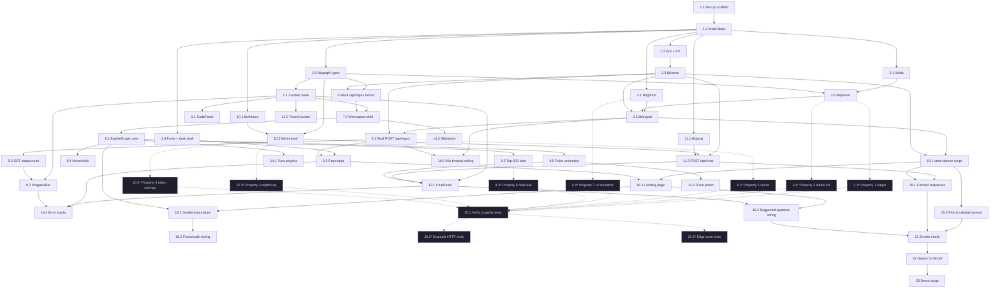

# Implementation Plan: Viberon

## Overview

48-hour hackathon plan for two engineers. The shortest path to a demo runs along the spine: scaffold → types/store → parser/ingest → bubble graph → retrieval/chat → demo seeding → polish → property tests → deploy. Tasks are sized to 1–4 hours and ordered into eight time blocks. Within each block, sub-tasks are independent enough to be assigned in parallel where possible. Property-based tests use `fast-check` and are tagged `Feature: viberon, Property N: <description>` so they are discoverable.

Key deliverables follow the design seams: `lib/` for pure modules, `app/api/` for the three routes, `components/` for the UI, `scripts/seed-demos.ts` for pre-warmed demos, and `tests/` for property + example tests.

## Tasks

### Block 1 — Setup & Foundation (hours 0–3)

- [x] 1. Scaffold the Next.js app and install dependencies
  - [x] 1.1 Create Next.js 15 App Router project with TypeScript and Tailwind
    - Files: `package.json`, `tsconfig.json`, `next.config.ts`, `tailwind.config.ts`, `postcss.config.mjs`, `app/layout.tsx`, `app/page.tsx`, `app/globals.css`
    - Run `pnpm create next-app@latest` (App Router, TS, Tailwind, ESLint, src dir = no, import alias `@/*`)
    - Initialize shadcn/ui (`pnpm dlx shadcn@latest init`) with neutral base color, dark mode default
    - Add `Button`, `Input`, `Card`, `ScrollArea`, `Badge`, `Skeleton`, `Toast` components via `shadcn add`
    - Acceptance: `pnpm dev` boots a dark-themed page; `tailwind` classes render
    - Duration: 1h
    - _Requirements: 7.1_

  - [x] 1.2 Install runtime + dev dependencies
    - Files: `package.json`, `pnpm-lock.yaml`
    - Runtime: `@babel/parser`, `@babel/traverse`, `@vercel/kv`, `@upstash/redis`, `react-force-graph-2d`, `groq-sdk`, `zustand`, `gpt-tokenizer`, `nanoid`, `tar`
    - Dev: `fast-check`, `vitest`, `@types/babel__traverse`, `@types/node`, `tsx`
    - Add `package.json` scripts: `"test": "vitest run"`, `"test:watch": "vitest"`, `"seed:demos": "tsx scripts/seed-demos.ts"`
    - Acceptance: `pnpm install` succeeds; `pnpm test` runs (zero tests so far is fine)
    - Duration: 0.5h
    - _Requirements: 8.5_

  - [x] 1.3 Configure environment variables and KV client
    - Files: `.env.local.example`, `.env.local`, `lib/kv.ts`
    - Document required env vars: `GROQ_API_KEY`, `KV_URL`, `KV_REST_API_URL`, `KV_REST_API_TOKEN`, `KV_REST_API_READ_ONLY_TOKEN`
    - Create thin `kv` re-export from `@vercel/kv` (or `@upstash/redis` fallback) with a runtime ping helper
    - Add the same vars to Vercel project (note in README; non-coding step is owner's responsibility — code only sets `process.env` reads)
    - Acceptance: `pnpm tsx -e "import('./lib/kv').then(m => m.ping())"` succeeds
    - Duration: 0.5h
    - _Requirements: 8.5_

  - [x] 1.4 Configure dark-mode shell, fonts, and metadata
    - Files: `app/layout.tsx`, `app/globals.css`
    - Use `next/font` for `Inter` (sans) and `JetBrains_Mono` (mono); expose CSS variables `--font-sans`, `--font-mono`
    - Set `<html class="dark">` permanently; apply background `#0B0B12`, surface `#15151F`
    - Add app metadata: title `Viberon`, description, og image placeholder
    - Acceptance: page renders with Inter body and Mono code blocks in dark mode
    - Duration: 1h
    - _Requirements: 7.1_

### Block 1 — Core types and IDs (parallel with 1.x above)

- [x] 2. Define shared types and ID helpers
  - [x] 2.1 Implement `lib/ids.ts`
    - Files: `lib/ids.ts`
    - Export `sha1(s: string): string` (hex) using Node `crypto` (works in Edge via WebCrypto wrapper; for Edge, use `crypto.subtle.digest`)
    - Export `nodeId(file, name, startLine): string` returning `sha1(...).slice(0,16)`
    - Acceptance: pure functions; deterministic outputs for fixed inputs
    - Duration: 0.5h
    - _Requirements: 2.5_

  - [x] 2.2 Implement `lib/graph.ts` types
    - Files: `lib/graph.ts`
    - Export `NodeKind`, `EdgeKind`, `GraphNode`, `GraphEdge`, `Graph`, `Job`, `JobStatus` exactly as in design
    - Reserve `embedding?: never` on `GraphNode`
    - Acceptance: `tsc --noEmit` clean
    - Duration: 0.5h
    - _Requirements: 2.2, 2.3, 2.4, 2.5, 2.6, 2.7_

  - [x] 2.3 Implement `lib/store.ts` KV abstraction
    - Files: `lib/store.ts`
    - Export `getGraph(repoKey)`, `putGraph(repoKey, g)`, `getJob(jobId)`, `putJob(job)`, `setRepoToJob(repoKey, jobId)`, `getDemoList()`, `setDemoList(keys)`, `putDemoMeta(meta)`, `getDemoMeta(repoKey)`
    - TTLs per design: `graph:*` 7d, `job:*` 1h, `repo2job:*` 1h, `demo:*` no ttl
    - Acceptance: get/put round-trip works against a real KV (or `@upstash/redis` equivalent)
    - Duration: 1h
    - _Requirements: 1.2, 1.3, 1.8, 2.9, 8.5_

  - [x] 2.4 Write property test for stable node IDs
    - Files: `tests/parser.props.test.ts` (stub now, body fills in 9.2)
    - **Property 2: Node IDs are stable across runs**
    - **Validates: Requirements 2.5, 2.9**
    - Tag: `Feature: viberon, Property 2: Node IDs are stable across runs`
    - _Requirements: 2.5_

### Block 2 — Ingestion pipeline (hours 3–8)

- [x] 3. Implement GitHub fetch and parser
  - [x] 3.1 Implement `lib/github.ts`
    - Files: `lib/github.ts`
    - Export `parseGitHubUrl(url): { owner, repo, ref } | null` — accept `https://github.com/o/r`, `.../tree/<ref>`, optional `.git` suffix; reject everything else
    - Export `formatGitHubUrl(ref)` returning canonical `https://github.com/owner/repo/tree/ref`
    - Export `fetchTarball(repoRef): AsyncIterable<{ path: string; source: string }>` using `https://codeload.github.com/owner/repo/tar.gz/refs/heads/<ref>` and `tar` package; default ref = `main` then fallback to `master`
    - Strip the top-level `repo-ref/` directory from each entry's path
    - Acceptance: against `expressjs/express`, yields `>0` `.js` files; invalid URLs return null
    - Duration: 2h
    - _Requirements: 1.4, 1.5, 1.6, 8.2_

  - [x] 3.2 Implement `lib/parser.ts` Babel walker
    - Files: `lib/parser.ts`
    - Export `parseRepo(files): Graph` per design pseudocode
    - Emit nodes for `FunctionDeclaration`, named `FunctionExpression`/`ArrowFunctionExpression` (assigned to a binding), `ClassDeclaration`
    - Project file-level `import` edges across all node pairs in source/target files
    - Resolve calls best-effort: same-file binding first, then imported-name; unresolved calls drop silently
    - Truncate snippets to 2000 chars; `loc = endLine - startLine + 1`; `folder = file.split('/')[0]`
    - On `babel.parse` throw, push `${path}: ${err.message}` to a returned `errors[]` and continue
    - Acceptance: parsing a fixture with 3 files produces nodes + edges matching expected counts
    - Duration: 3h
    - _Requirements: 2.1, 2.2, 2.3, 2.4, 2.5, 2.6, 2.7, 2.8_

  - [x] 3.3 Write property test for edge endpoint integrity
    - Files: `tests/parser.props.test.ts`
    - **Property 1: Edge endpoints reference existing nodes**
    - **Validates: Requirements 2.3, 2.4, 2.9**
    - Use `fast-check` to generate small random multi-file source bundles; assert every edge's `source`/`target` is in the node id set
    - Tag: `Feature: viberon, Property 1: Edge endpoints reference existing nodes`
    - _Requirements: 2.3, 2.4_

  - [x] 3.4 Complete property test for stable node IDs
    - Files: `tests/parser.props.test.ts`
    - Run `parseRepo` twice on the same generated bundle; assert id sets are equal and each id matches `sha1(file+':'+name+':'+startLine).slice(0,16)`
    - Tag: `Feature: viberon, Property 2: Node IDs are stable across runs`
    - _Requirements: 2.5_

  - [x] 3.5 Implement `lib/ingest.ts` orchestration with progress
    - Files: `lib/ingest.ts`
    - Export `ingest(repoRef, onProgress?: (p:number)=>void): Promise<Graph>`
    - Pipeline: `fetchTarball` → filter to `.ts|.tsx|.js|.jsx` → 500-file cap check (throw `RepoTooLargeError` if exceeded) → `parseRepo` → return Graph with `meta`
    - Emit `onProgress` after each batch of 25 files (clamped to 5..95)
    - Also persist `files:{repoKey}` blob for retrieval baseline (compressed JSON of `{ path: source }`)
    - Acceptance: ingesting a 5-file fixture returns a Graph; progress callback fires monotonically
    - Duration: 1.5h
    - _Requirements: 1.7, 2.9, 8.1_

- [x] 4. Mock ingestion endpoint with a static fixture (frontend unblocker)
  - Files: `app/api/repos/route.ts`, `app/api/repos/[jobId]/status/route.ts`, `tests/fixtures/mock-graph.json`
  - Initial implementation: validate URL (400 on invalid), if URL contains `mock` return a `jobId` whose status resolves to `succeeded` with `tests/fixtures/mock-graph.json`
  - This unblocks Block 3 UI work while parser/ingest finish
  - Acceptance: `curl -d '{"url":"https://github.com/mock/repo"}' /api/repos` returns 202 + jobId; status endpoint returns the fixture graph
  - Duration: 1h
  - _Requirements: 1.1, 1.2, 1.3, 1.5_

- [x] 5. Wire real ingestion into `/api/repos`
  - [x] 5.1 Replace mock with real ingest in `POST /api/repos`
    - Files: `app/api/repos/route.ts`
    - `runtime = 'nodejs'`, `maxDuration = 60`
    - Flow: `parseGitHubUrl` → `repoKey = sha1(repoRef).slice(0,16)` → `getGraph` cache check → if hit, write a `succeeded` Job and return 202; else write `queued`, call `ctx.waitUntil(runIngestion(...))` which streams progress to KV
    - On `RepoTooLargeError` → `failed` with cap message; on tarball non-2xx → `failed` with status; on timeout (>55s elapsed) → `failed` with `Ingestion timeout`
    - Acceptance: real public repo url ingests; second call within TTL is instant cache hit
    - Duration: 2h
    - _Requirements: 1.1, 1.2, 1.4, 1.5, 1.6, 1.7, 1.8, 8.1_

  - [x] 5.2 Implement `GET /api/repos/[jobId]/status`
    - Files: `app/api/repos/[jobId]/status/route.ts`
    - Return `{ status, progress, error?, errors?, graph? }`; include `graph` only when `succeeded`
    - 404 when job missing
    - Acceptance: client polling sees progress climb, then `succeeded` with graph payload
    - Duration: 0.5h
    - _Requirements: 1.3_

  - [x] 5.3 Write property test for cache idempotence
    - Files: `tests/ingest.props.test.ts`
    - **Property 5: Cache idempotence on ingestion**
    - **Validates: Requirements 1.8, 8.5**
    - Stub `fetchTarball`/`parseRepo` with spies; for any pre-seeded `graph:{repoKey}`, repeated POSTs do not invoke the spies and the resulting jobs resolve to `succeeded` with deeply equal graphs
    - Tag: `Feature: viberon, Property 5: Cache idempotence on ingestion`
    - _Requirements: 1.8_

  - [x] 5.4 Write property test for URL parse round-trip
    - Files: `tests/github.props.test.ts`
    - **Property 7: Repo URL parse round-trip**
    - **Validates: Requirements 1.2, 1.5**
    - For valid URLs: `parseGitHubUrl(formatGitHubUrl(parseGitHubUrl(s))) === parseGitHubUrl(s)`; invalid URLs always return null
    - Tag: `Feature: viberon, Property 7: Repo URL parse round-trip`
    - _Requirements: 1.5_

- [x] 6. Checkpoint — ingestion ready
  - Ensure the mock fixture, real ingest path, and status polling all work end-to-end. Ask the user if questions arise.

### Block 3 — Bubble graph UI + workspace layout (hours 8–14)

- [x] 7. Build the Zustand store and routing skeleton
  - [x] 7.1 Create `store/viberon.ts`
    - Files: `store/viberon.ts`
    - Implement state per design: `graph`, `selectedNodeId`, `pulseIds`, `messages`, `tokens`
    - Actions: `setGraph`, `selectNode`, `pulse(ids)` (clears after 2.5s), `appendUserMessage`, `appendAssistantChunk`, `setTokens`, `resetChat`
    - Acceptance: a unit test (or quick `console.log` harness) flips state correctly
    - Duration: 1h
    - _Requirements: 3.7, 5.6, 6.3_

  - [x] 7.2 Create workspace route shell `app/workspace/[repoKey]/page.tsx`
    - Files: `app/workspace/[repoKey]/page.tsx`
    - Server component fetches `getGraph(repoKey)` and passes to a client `<Workspace>`
    - Two-column split (graph left flex-1, right column 420px) with skeletons
    - When no graph yet: show `<ProgressBar jobId={...} />` instead of chat
    - Acceptance: navigating with a seeded `repoKey` renders a split layout with the graph object available to the client
    - Duration: 1h
    - _Requirements: 3.1_

- [x] 8. Implement BubbleGraph
  - [x] 8.1 Build `components/BubbleGraph.tsx` core renderer
    - Files: `components/BubbleGraph.tsx`, `lib/colors.ts`
    - Wrap `react-force-graph-2d` with `nodeCanvasObject` per design (radial gradient, size from `loc`)
    - Compute folder→hue mapping in `lib/colors.ts` (12-hue palette via hash mod)
    - Disable physics after stabilization (`cooldownTicks=80`) for smooth interaction
    - Acceptance: graph from fixture renders bubbles sized by LOC, colored by folder
    - Duration: 2h
    - _Requirements: 3.1, 3.2, 3.3_

  - [x] 8.2 Implement top-500 fade rule
    - Files: `components/BubbleGraph.tsx`, `lib/graph-helpers.ts`
    - Add `topByDegree(nodes, edges, k=500): Set<string>` in `lib/graph-helpers.ts` (deterministic tie-break by `id`)
    - Apply `globalAlpha=0.25` for non-top nodes during draw
    - Acceptance: 600-node fixture shows 500 crisp + 100 faded
    - Duration: 1h
    - _Requirements: 3.4_

  - [x] 8.3 Write property test for top-500 fade rule
    - Files: `tests/graph-helpers.props.test.ts`
    - **Property 6: Top-500 fade rule**
    - **Validates: Requirements 3.4**
    - For random graphs > 500 nodes, assert `topByDegree` returns exactly 500 nodes equal to the highest `inDegree+outDegree` (ties broken by id)
    - Tag: `Feature: viberon, Property 6: Top-500 fade rule`
    - _Requirements: 3.4_

  - [x] 8.4 Add hover and click interactions
    - Files: `components/BubbleGraph.tsx`
    - Hover: highlight the bubble and any node connected by exactly one edge (boost stroke/alpha; dim others)
    - Click: call `onSelect(node)` which sets `selectedNodeId` in Zustand
    - Acceptance: hovering shows neighbor highlight; clicking updates `CodePanel`
    - Duration: 1.5h
    - _Requirements: 3.5, 3.6_

  - [x] 8.5 Implement pulse animation hook
    - Files: `components/BubbleGraph.tsx`, `lib/pulse.ts`
    - On `pulseIds` change, draw an expanding accent ring per pulsed node for 2.5s using `requestAnimationFrame` and ease-out
    - Acceptance: calling `pulse([...])` from the store visibly animates the corresponding bubbles for ~2.5s
    - Duration: 1h
    - _Requirements: 3.7_

- [x] 9. Build the supporting right-column components
  - [x] 9.1 Implement `components/CodePanel.tsx`
    - Files: `components/CodePanel.tsx`
    - Reads `selectedNodeId` from store; shows file path, signature, and `<pre>` snippet styled with JetBrains Mono
    - Acceptance: clicking a bubble updates the panel to that node's signature/snippet
    - Duration: 0.5h
    - _Requirements: 3.6_

  - [x] 9.2 Implement `components/ProgressBar.tsx`
    - Files: `components/ProgressBar.tsx`
    - Polls `/api/repos/{jobId}/status` every 1s; stops on `succeeded`/`failed`; calls `setGraph` on success
    - Determinate Tailwind bar with smooth width transition
    - Acceptance: progress climbs from 0 to 100 over a real ingestion
    - Duration: 1h
    - _Requirements: 1.3_

  - [x] 9.3 Implement `components/RepoInput.tsx`
    - Files: `components/RepoInput.tsx`
    - Pill-shaped `Input` + `Button`, client-side regex validation, posts to `/api/repos`, navigates to `/workspace/{repoKey}` on response
    - Show inline error on 400; show toast on 5xx
    - Acceptance: valid URL kicks off ingestion and navigates; invalid URL shows error
    - Duration: 1h
    - _Requirements: 1.1, 1.5, 7.4_

### Block 4 — Retrieval + chat API + chat panel (hours 14–20)

- [x] 10. Implement retrieval and tokenizer
  - [x] 10.1 Implement `lib/tokens.ts`
    - Files: `lib/tokens.ts`
    - Wrap `gpt-tokenizer` cl100k_base; export `countTokens(s: string): number`
    - Acceptance: `countTokens('hello world')` returns a positive integer
    - Duration: 0.25h
    - _Requirements: 6.1_
  - [x] 10.2 Implement `lib/retrieval.ts` `selectContext`
    - Files: `lib/retrieval.ts`
    - TF-IDF over `name + JSDoc(snippet)` per node with simple tokenizer (lowercase, alnum, stop-words list)
    - Top-5 seeds → undirected BFS depth 2 over `import|call` edges → cap at 30 nodes (highest scores)
    - Build `contextString` via `formatNodeForPrompt` and compute `selectedTokens` and `baselineTokens` (sum of `countTokens(file)` over referenced files)
    - Empty-graph branch returns `{ nodeIds: [], contextString: '', selectedTokens: 0, baselineTokens: 0 }`
    - Acceptance: small fixture returns ≤30 ids reachable from seeds within 2 hops
    - Duration: 2h
    - _Requirements: 4.1, 4.2, 4.3, 4.4, 4.5, 6.1_

  - [x] 10.3 Write property test for retrieval depth and cap
    - Files: `tests/retrieval.props.test.ts`
    - **Property 3: Retrieval respects depth and cap**
    - **Validates: Requirements 4.2, 4.3, 4.4**
    - For random graphs and queries: assert `nodeIds.length ≤ 30` and every selected id is reachable from some TF-IDF seed within ≤2 edges over union(import,call)
    - Tag: `Feature: viberon, Property 3: Retrieval respects depth and cap`
    - _Requirements: 4.2, 4.3_

  - [x] 10.4 Write property test for non-negative token savings
    - Files: `tests/retrieval.props.test.ts`
    - **Property 4: Token savings are non-negative**
    - **Validates: Requirements 6.1, 6.2**
    - Stub `files` so referenced files are at least the union of selected snippets; assert `baselineTokens >= selectedTokens`
    - Tag: `Feature: viberon, Property 4: Token savings are non-negative`
    - _Requirements: 6.1, 6.2_

- [x] 11. Implement chat API and provider abstraction
  - [x] 11.1 Implement `lib/groq.ts` provider abstraction
    - Files: `lib/groq.ts`
    - Export `chatStream({ model, messages }): AsyncIterable<string>` wrapping Groq SDK with `stream: true`
    - Yield only the delta text content per chunk
    - Acceptance: `for await (const t of chatStream(...))` produces tokens against the live Groq API
    - Duration: 0.75h
    - _Requirements: 5.1, 5.2_

  - [x] 11.2 Implement `POST /api/chat`
    - Files: `app/api/chat/route.ts`, `lib/sse.ts`
    - `runtime = 'edge'`
    - Load `getGraph(repoKey)`; if missing → SSE error and end; if empty → SSE error per Req 4.5
    - Call `selectContext`, then `chatStream` with messages built per design prompt shape (system + context + history + user)
    - Stream `data: {"t":"..."}` per token; end with `data: {"done":true,"nodeIds":[...],"selectedTokens":N,"baselineTokens":M}`
    - On Groq error: emit `data: {"error":"..."}` then close
    - Acceptance: `curl -N` against the route streams text and a final done event
    - Duration: 1.5h
    - _Requirements: 5.1, 5.2, 5.3, 5.4, 5.5, 6.1, 6.2_

- [x] 12. Build the ChatPanel and TokenCounter
  - [x] 12.1 Implement `components/ChatPanel.tsx`
    - Files: `components/ChatPanel.tsx`
    - Message list (user/assistant bubbles), `Input` + send button, suggested-question chips (props from page)
    - On submit: append user message, open `fetch` against `/api/chat`, parse SSE chunks with a small reader, append assistant chunks via `appendAssistantChunk`
    - On `done` event: call `pulse(nodeIds)` and `setTokens({ selected, baseline })`
    - On `error` event: shadcn `Toast` with retry
    - Acceptance: a real query streams tokens, pulses bubbles, and updates the counter
    - Duration: 2h
    - _Requirements: 5.1, 5.2, 5.4, 5.5, 5.6, 3.7_

  - [x] 12.2 Implement `components/TokenCounter.tsx`
    - Files: `components/TokenCounter.tsx`
    - Animated savings number using `requestAnimationFrame` interpolation; shows `selected | baseline | savings`
    - Updates on `tokens` store change
    - Acceptance: counter animates after each chat reply
    - Duration: 0.75h
    - _Requirements: 6.2, 6.3_

- [x] 13. Checkpoint — chat works end-to-end on the mock graph
  - Ensure all tests pass, ask the user if questions arise.

### Block 5 — Polish interactions (hours 20–26)

- [x] 14. Tune visuals and interactions
  - [x] 14.1 Tune force-graph physics
    - Files: `components/BubbleGraph.tsx`
    - Adjust `linkDistance`, `chargeStrength`, `cooldownTicks` for a calm spread; set min/max zoom
    - Acceptance: 200-node fixture lays out without overlap in <2s
    - Duration: 0.5h
    - _Requirements: 3.1_

  - [x] 14.2 Polish pulse timing and easing
    - Files: `lib/pulse.ts`
    - Confirm 2.5s duration, ease-out radius growth, fade alpha 1→0
    - Acceptance: visual review against design accent color
    - Duration: 0.5h
    - _Requirements: 3.7_

  - [x] 14.3 Add loading skeletons
    - Files: `components/Skeletons.tsx`, `app/workspace/[repoKey]/page.tsx`, `app/page.tsx`
    - Skeletons for: graph (animated grid), chat panel (3 bubbles), code panel (lines), demo cards (cards)
    - Acceptance: route transitions never show blank panes
    - Duration: 0.75h
    - _Requirements: 7.1_

  - [x] 14.4 Wire error toasts
    - Files: `app/layout.tsx`, `components/ChatPanel.tsx`, `components/RepoInput.tsx`, `components/ProgressBar.tsx`
    - Mount shadcn `<Toaster />` once in root layout; surface API errors via `toast(...)` calls in client components
    - Acceptance: triggering each error path shows a toast and never blanks the page
    - Duration: 0.75h
    - _Requirements: 1.5, 1.6, 1.7, 5.5_

### Block 6 — Demo seeding + landing page (hours 26–32)

- [x] 15. Build the seeding pipeline
  - [x] 15.1 Implement `scripts/seed-demos.ts`
    - Files: `scripts/seed-demos.ts`, `lib/demo.ts`
    - `lib/demo.ts` exports the `DEMOS` array (3 small repos that fit under 500 files and avoid heavy TS path aliases) with `repoRef`, `name`, `blurb`, `questions`
    - Script iterates `DEMOS`, calls `ingest`, writes `graph:{repoKey}`, `demo:{repoKey}` (with stats), and `demo:list`
    - Logs and skips on `RepoTooLargeError` so a substitute can be picked
    - Acceptance: `pnpm seed:demos` populates KV; `getDemoList()` returns 2-3 keys
    - Duration: 1h
    - _Requirements: 7.2, 7.3_

  - [x] 15.2 Pick and validate 3 demo repos
    - Files: `lib/demo.ts`
    - Candidates (replace if any exceed cap during seeding): `expressjs/express@master` (filter to top-level `lib/`), `koajs/koa@master`, `lukeed/clsx@master`
    - Each must have 2-3 pre-canned questions written into the entry
    - Acceptance: all 3 ingest within 60s on a manual run
    - Duration: 1h
    - _Requirements: 7.2, 7.5, 8.1_

- [x] 16. Build the landing page
  - [x] 16.1 Implement `app/page.tsx`
    - Files: `app/page.tsx`, `components/DemoCard.tsx`
    - Hero with one-line pitch and accent gradient
    - `<RepoInput />` centered
    - Reads `getDemoList()` + `getDemoMeta()` server-side; renders `DemoCard` per demo with name, blurb, stats (`nodes · files`), and clickable suggested-question chips
    - Footer with hackathon credits
    - Acceptance: landing renders with 3 demo cards; clicking a card navigates to workspace with the pre-warmed graph
    - Duration: 2h
    - _Requirements: 7.1, 7.2, 7.3, 7.4, 7.5, 7.6_
  - [x] 16.2 Wire suggested questions into chat
    - Files: `components/DemoCard.tsx`, `components/ChatPanel.tsx`
    - Clicking a suggested question on a demo card navigates to `/workspace/{repoKey}?q=<question>`; ChatPanel reads `searchParams.q` on mount and submits once
    - Acceptance: clicking the chip navigates and auto-submits the chat query
    - Duration: 0.75h
    - _Requirements: 7.5_

- [x] 17. Checkpoint — demo flow ready
  - Ensure all tests pass, ask the user if questions arise.

### Block 7 — Visual polish and resilience (hours 32–40)

- [x] 18. Tighten the visual layer
  - [x] 18.1 Refine accent gradients and surfaces
    - Files: `app/globals.css`, `components/BubbleGraph.tsx`, `components/DemoCard.tsx`
    - Hero radial gradient, card hover lift, accent purple `#A855F7` and cyan `#22D3EE` per design
    - Acceptance: side-by-side review against design styling section passes
    - Duration: 1h
    - _Requirements: 7.1_

  - [x] 18.2 Confirm fonts and code styling
    - Files: `app/globals.css`, `components/CodePanel.tsx`
    - Inter weights 400/500/600 in body; JetBrains Mono in `<pre>` and signatures with subtle line-height
    - Acceptance: typography review passes
    - Duration: 0.5h
    - _Requirements: 7.1_

- [x] 19. Add resilience
  - [x] 19.1 Backup canned responses for demo questions
    - Files: `lib/canned.ts`, `app/api/chat/route.ts`
    - Map of `(repoKey, question) → answer + nodeIds`; if `chatStream` errors and the request matches a canned key, stream the canned answer with `done` event
    - Acceptance: simulating Groq failure on a demo question still returns a working stream and pulse
    - Duration: 1h
    - _Requirements: 5.5_

  - [x] 19.2 Respect 60s ingestion ceiling
    - Files: `lib/ingest.ts`, `app/api/repos/route.ts`
    - On elapsed > 55s, persist whatever progress exists and mark `failed` with `Ingestion timeout`
    - Acceptance: artificial delay test trips the timeout cleanly
    - Duration: 0.5h
    - _Requirements: 8.1_

### Block 8 — Property tests, deploy, rehearsal (hours 40–48)

- [x] 20. Finalize property and example tests
  - [x] 20.1 Verify all 7 property tests are present and tagged
    - Files: `tests/parser.props.test.ts`, `tests/ingest.props.test.ts`, `tests/github.props.test.ts`, `tests/retrieval.props.test.ts`, `tests/graph-helpers.props.test.ts`
    - Each `it.each` / `test` description must include the tag `Feature: viberon, Property N: <description>`
    - Run `pnpm test`; all properties pass with ≥100 iterations each
    - Acceptance: `pnpm test` green; tags grep-discoverable
    - Duration: 1h
    - _Requirements: 1.5, 1.8, 2.3, 2.4, 2.5, 3.4, 4.2, 4.3, 6.1, 6.2_

  - [x] 20.2 Add example tests for HTTP contracts
    - Files: `tests/api.example.test.ts`
    - 202 on valid POST; 400 on invalid URL; 404 on unknown jobId; SSE done event shape
    - _Requirements: 1.1, 1.5, 5.4_

  - [x] 20.3 Add edge-case tests for boundaries
    - Files: `tests/edges.example.test.ts`
    - File counts {0, 1, 500, 501}; nodes with zero LOC; queries that are stop-words only; non-ASCII folder names
    - _Requirements: 1.7, 4.1, 8.2_

- [x] 21. Pre-deploy smoke check
  - Files: `scripts/smoke.ts`
  - Script: ingest each demo (or hit cache), run a known query through `/api/chat`, assert `nodeIds.length > 0` and `selectedTokens > 0`
  - `package.json` script: `"smoke": "tsx scripts/smoke.ts"`
  - Acceptance: `pnpm smoke` passes against all 3 demos
  - Duration: 1h
  - _Requirements: 7.2, 7.3, 8.1_

- [x] 22. Deploy to Vercel
  - Files: `vercel.json` (only if needed), `README.md`
  - Push branch; configure env vars in Vercel project; verify production deployment
  - Run `pnpm seed:demos` against production KV (one-off)
  - Acceptance: production URL serves landing with 3 demo cards; clicking each loads workspace and chat works
  - Duration: 1h
  - _Requirements: 8.5_

- [x] 23. Demo rehearsal artifacts
  - Files: `docs/demo-script.md`
  - Write a 90-second demo script: open landing → click demo card → ask first canned question → highlight pulse + token savings → ask follow-up → wrap
  - Acceptance: script runs in under 90 seconds with a stopwatch on the deployed app
  - Duration: 0.5h
  - _Requirements: 7.2, 7.3, 7.5_

- [x] 24. Final checkpoint — ship
  - Ensure all tests pass and the deployed demo flow works end-to-end. Ask the user if questions arise.

## Notes

- Tasks marked with `*` are optional and can be skipped for a faster MVP. Property tests are marked optional but every Phase-1 property is included so they can be enabled once the core implementation lands.
- Each task references specific requirements (and where applicable, a property number from the design's Correctness Properties section) for traceability.
- The mock fixture endpoint (Task 4) is the parallelization unlock: frontend (Block 3) can build against the fixture while parser/ingest finishes in Block 2.
- Property tests are tagged `Feature: viberon, Property N: <description>` for grep discoverability.
- Checkpoints (Tasks 6, 13, 17, 24) are scheduled at the natural integration seams of each block.

## Task Dependency Graph (Mermaid)

The Mermaid graph below shows hard blocking edges between tasks. Tasks at the same depth can be run in parallel.



## Task Dependency Graph

```json
{
  "waves": [
    { "id": 0, "tasks": ["1.1"] },
    { "id": 1, "tasks": ["1.2"] },
    { "id": 2, "tasks": ["1.3", "1.4", "2.1", "2.2", "3.1", "10.1", "11.1"] },
    { "id": 3, "tasks": ["2.3", "2.4", "3.2", "7.1", "10.2", "5.4"] },
    { "id": 4, "tasks": ["3.3", "3.4", "3.5", "4", "9.1", "10.3", "10.4", "11.2", "12.2"] },
    { "id": 5, "tasks": ["5.1", "7.2", "15.1"] },
    { "id": 6, "tasks": ["5.2", "5.3", "8.1", "9.3", "14.3", "15.2", "19.2"] },
    { "id": 7, "tasks": ["8.2", "8.4", "8.5", "9.2", "14.1", "16.1", "19.1"] },
    { "id": 8, "tasks": ["8.3", "12.1", "14.2", "18.1"] },
    { "id": 9, "tasks": ["14.4", "16.2", "18.2"] },
    { "id": 10, "tasks": ["20.1"] },
    { "id": 11, "tasks": ["20.2", "20.3", "21"] },
    { "id": 12, "tasks": ["22"] },
    { "id": 13, "tasks": ["23"] }
  ]
}
```
